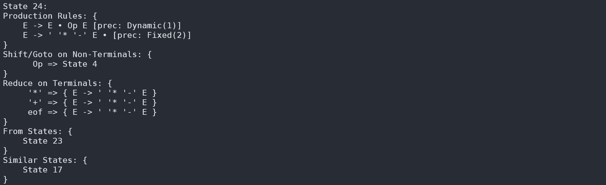
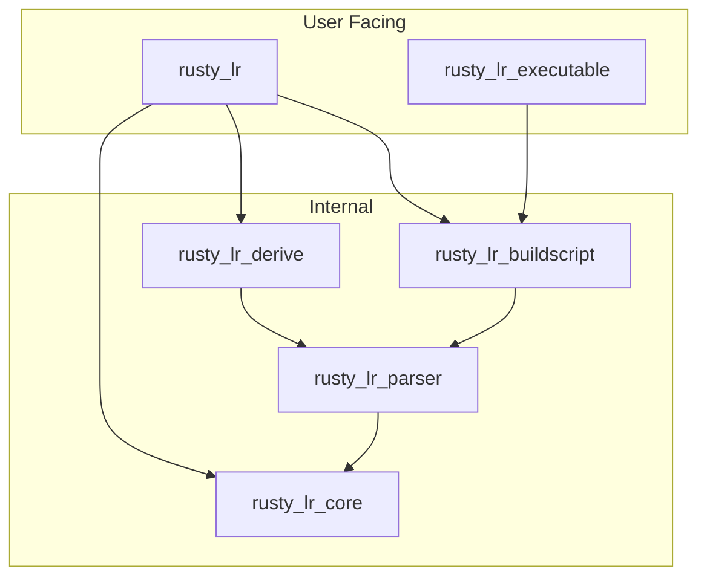

# rusty_lr
[](https://crates.io/crates/rusty_lr)
[](https://docs.rs/rusty_lr)

***A Bison-like Parser generator & Compiler frontend for Rust generating optimised IELR(1), LALR(1) parser tables, with deterministic LR and non-deterministic LR (GLR) parsing.***

RustyLR is a parser generator that converts context-free grammars into IELR(1)/LALR(1) tables and supporting deterministic LR and non-deterministic GLR parsing strategies. It supports custom reduce actions in Rust, with beautiful diagnostics.
Highly inspired by tools like *bison*, it uses a similar syntax while integrating seamlessly with Rust's ecosystem.
It constructs optimized state machines, ensuring efficient and reliable parsing.


## Features
 - **Custom Reduce Actions:** Define custom actions in Rust, allowing you to build custom data structures easily.
 - **Automatic Optimization:** Reduces parser table size and improves performance by grouping terminals with identical behavior across parser states.
 - **Multiple Parsing Strategies:** Supports minimal-LR(1), LALR(1) parser tables, and GLR parsing strategy.
 - **Detailed Diagnostics:** Detects grammar conflicts, verbose conflict resolution stages, and optimization stages.
 - **Static & Runtime Conflict Resolution:** Provides mechanisms to resolve conflicts at compile time or runtime.
 - **Location Tracking:** Tracks the location of every token in the parse tree, useful for error reporting and debugging.
 - **State Machine Debugging:** The `rustylr` executable provides a `--state` option that allows you to debug and visualize the generated state machine. This is useful for understanding how the parser will behave and for identifying potential issues in the grammar.

## Quick Start: Using the `rustylr` Executable

The recommended way to use RustyLR is with the standalone `rustylr` executable. It's faster, provides richer grammar diagnostics, and includes commands for debugging state machines directly.

Here is a step-by-step guide to get you started.

**1. Add `rusty_lr` to your dependencies**

First, add the `rusty_lr` runtime library to your project's `Cargo.toml`. The generated parser code will depend on it.

```toml
[dependencies]
rusty_lr = "..." # Use the same version as the executable
```

**2. Install the `rustylr` executable**

You can install the executable from crates.io using `cargo`:

```bash
cargo install rustylr
```

**3. Create a grammar file**

Create a file named `src/grammar.rs`. This file will contain your token definitions and grammar rules. Any Rust code above the `%%` separator will be copied directly to the generated output file.

```rust
// src/grammar.rs
// This code is copied to the generated file.
pub enum MyToken {
    Num(i32),
    Plus,
}

%% // Grammar rules start here.

%tokentype MyToken;
%start E;
%left plus; // Specify left-associativity for the 'plus' token.

// Define tokens and how they map to MyToken variants.
%token num MyToken::Num(_);
%token plus MyToken::Plus;

// Define grammar rules and their return types.
// E(i32) means the non-terminal E returns an i32.
// In the action blocks `{ ... }`, you can refer to the values of symbols
// on the right-hand side by their names (e.g., `e1`, `e2`, `num`).
E(i32): e1=E plus e2=E { e1 + e2 }
      | num { let MyToken::Num(num) = num else { unreachable!(); };
        num
      }
      ;
```

**4. Generate the parser code**

Run the `rustylr` executable to process your grammar file. This command will generate `src/parser.rs` from `src/grammar.rs`.

```bash
rustylr src/grammar.rs src/parser.rs
```

**5. Use the generated parser in your code**

Finally, include the newly generated `src/parser.rs` as a module in your `main.rs` or `lib.rs` and use it to parse a token stream.

```rust
// In src/main.rs

// Include the generated parser module.
mod parser;
// Bring the token enum into scope.
use parser::MyToken;

fn main() {
    // Example token stream for "1 + 2"
    let tokens = vec![MyToken::Num(1), MyToken::Plus, MyToken::Num(2)]; 

    let parser = parser::EParser::new();        // Assumes 'E' is your start symbol
    let mut context = parser::EContext::new();
    let mut userdata = (); // No userdata in this example.

    for token in tokens {
        match context.feed(&parser, token, &mut userdata) {
            Ok(_) => {}
            Err(e) => {
                eprintln!("Parse error: {}", e);
                return;
            }
        }
    }

    // Get the final parsed result.
    match context.accept(&parser) {
        Ok(result) => {
            let final_result: i32 = result;
            println!("Parsed result: {}", final_result); // Should print "3"
        },
        Err(e) => {
            eprintln!("Failed to produce a final result: {}", e);
        }
    }
}
```

**Important:** Ensure the version of the `rustylr` executable you run matches the version of the `rusty_lr` crate in your `Cargo.toml`. Mismatched versions can lead to build errors.


## Generated Code Structure

The generated code will include several structs and enums:
 - `<Start>Parser`: A struct that holds the parser table. [(LR docs)](https://docs.rs/rusty_lr/latest/rusty_lr/lr/trait.Parser.html) [(GLR docs)](https://docs.rs/rusty_lr/latest/rusty_lr/glr/trait.Parser.html)
 - `<Start>Context`: A struct that maintains the current parsing state and symbol values. [(LR docs)](https://docs.rs/rusty_lr/latest/rusty_lr/lr/struct.Context.html) [(GLR docs)](https://docs.rs/rusty_lr/latest/rusty_lr/glr/struct.Context.html)
 - `<Start>State`: A type representing a parser state and its associated table. 
 - `<Start>Rule`: A type representing a production rule. [(docs)](https://docs.rs/rusty_lr/latest/rusty_lr/struct.ProductionRule.html)
 - `<Start>NonTerminals`: An enum representing all non-terminal symbols in the grammar. [(docs)](https://docs.rs/rusty_lr/latest/rusty_lr/trait.NonTerminal.html)


### Working with Context
You can also get contextual information from the `<Start>Context` struct:
```rust
let mut context = <Start>Context::new();

// ... parsing ...

context.expected_token();    // Get expected (terminal, non-terminal) symbols for current state
context.can_feed(&term);     // Check if a terminal symbol can be fed
context.trace();             // Get all `%trace` non-terminals currently being parsed
println!("{}", context.backtrace()); // Print backtrace of the parser state
println!("{}", context);     // Print tree structure of the parser state (`tree` feature)
```

### The Feed Method
The generated code includes a `feed` method that processes tokens:

```rust
context.feed(&parser, term, &mut userdata); // Feed a terminal symbol and update the state machine
context.feed_location(&parser, term, &mut userdata, term_location); // Feed a terminal symbol with location tracking
```

This method returns `Ok(())` if the token was successfully parsed, or an `Err` if there was an error.

**Note:** The actual method signatures differ slightly when building a GLR parser.

## GLR Parsing
RustyLR offers built-in support for Generalized LR (GLR) parsing, enabling it to handle ambiguous or nondeterministic grammars that traditional LR(1) or LALR(1) parsers cannot process.
See [GLR.md](GLR.md) for details.

## Error Handling and Conflict Resolution
RustyLR provides multiple mechanisms for handling semantic errors and resolving conflicts during parsing:
 - **Panic Mode Error Recovery:** Use the `error` token for panic-mode error recovery
 - **Operator Precedence:** Set precedence with `%left`, `%right`, `%precedence` for terminals
 - **Reduce Rule Priority:** Set priority with `%dprec` for production rules
 - **Runtime Errors:** Return `Err` from reduce actions to handle semantic errors

See [SYNTAX.md - Resolving Conflicts](SYNTAX.md#resolving-conflicts) for detailed information.

## Location Tracking
Track the location of tokens and non-terminals for better error reporting and debugging:

```rust
Expr: exp1=Expr '+' exp2=Expr {
    println!("Location of exp1: {:?}", @exp1);
    println!("Location of exp2: {:?}", @exp2);
    println!("Location of this expression: {:?}", @$); // @$ is the location of the non-terminal itself
    exp1 + exp2
}
| Expr error Expr {
    println!("Error at: {:?}", @error); // @error is the location of the error token
    0 // Return a default value
}
```

See [SYNTAX.md - Location Tracking](SYNTAX.md#location-tracking) for detailed information.

## State Machine Debugging
The `rustylr` executable includes a powerful `--state` option for debugging the generated parser's state machine. This feature allows you to inspect the details of each state, including its production rules, expected tokens, and transitions to other states. It is an invaluable tool for diagnosing grammar ambiguities, understanding shift/reduce conflicts, and verifying that the parser behaves as expected.

To use it, run `rustylr` with the `--state` flag, followed by your grammar file:

```bash
rustylr --state src/grammar.rs
```

This will output a detailed, color-coded representation of the state machine directly in your terminal, making it easy to trace the parser's logic.



This visualization helps you understand the parsing process step-by-step and is particularly useful for debugging complex grammars.

## Examples
 - [Calculator (enum version)](examples/calculator/src/parser.rs): A numeric expression parser using custom token enums
 - [Calculator (u8 version)](examples/calculator_u8/src/parser.rs): A numeric expression parser using byte tokens
 - [JSON Validator](examples/json/src/parser.rs): A JSON syntax validator
 - [Lua 5.4 syntax parser](https://github.com/ehwan/lua_rust/blob/main/parser/src/parser.rs): A complete Lua language parser
 - [C language parser](https://github.com/ehwan/C-language-Parser-In-Rust/blob/main/src/ast/parser_lr.rs): A C language parser
 - [Bootstrap parser](rusty_lr_parser/src/parser/parser.rs): RustyLR's own syntax parser is written in RustyLR itself

## Cargo Features
 - `build`: Enables build script tools for generating parsers at compile time.
 - `tree`: Enables automatic syntax tree construction for debugging purposes. Makes `Context` implement `Display` for pretty-printing.

## Grammar Syntax
RustyLR's grammar syntax is inspired by traditional Yacc/Bison formats.
See [SYNTAX.md](SYNTAX.md) for detailed grammar definition syntax.

## Contributing
Contributions are welcome! Please feel free to open an issue or submit a pull request.

### Project Structure
This project is organized as a Cargo workspace with the following crates:

 - **`rusty_lr/`**: The main end-user library that provides the public API. This is what users add to their `Cargo.toml`.
 - **`rusty_lr_core/`**: Core parsing engine containing the fundamental data structures, algorithms, and runtime components for both deterministic (`src/parser/deterministic`) and non-deterministic (`src/parser/nondeterministic`) parsing.
 - **`rusty_lr_parser/`**: The main code generation engine that parses RustyLR's grammar syntax, builds parser tables, and generates the actual parser code. This is the core of the parser generation process.
 - **`rusty_lr_derive/`**: Procedural macro interface that wraps `rusty_lr_parser` to provide the `lr1!` macro for inline grammar definitions.
 - **`rusty_lr_buildscript/`**: Build script interface that wraps `rusty_lr_parser` for generating parser code at compile time when using the `build` feature.
 - **`rusty_lr_executable/`**: Standalone `rustylr` executable for command-line parser generation.
 - **`scripts/`**: Development and testing scripts

The crates have the following dependency relationships:
- `rusty_lr` depends on `rusty_lr_core`, `rusty_lr_derive`, and `rusty_lr_buildscript` (optional)
- `rusty_lr_derive` and `rusty_lr_buildscript` depend on `rusty_lr_parser`
- `rusty_lr_parser` depends on `rusty_lr_core`
- `rusty_lr_executable` depends on `rusty_lr_buildscript`




### About the Versioning
RustyLR consists of two big parts:
  - executable (`rustylr`), the code generator
  - runtime (`rusty_lr`), the main library

Since the `cargo` automatically uses the latest patch in `major.minor.patch` version of a crate, we increase the patch number only if the generated code is compatible with the runtime. That is, for any user who is not using buildscript or proc-macro, and using the executable-generated code itself,
any code change that could make compile errors with the previous generated code will result in a minor version bump.

## License
This project is dual-licensed under either of the following licenses, at your option:

 - MIT License ([LICENSE-MIT](LICENSE-MIT) or http://opensource.org/licenses/MIT)
 - Apache License, Version 2.0 ([LICENSE-APACHE](LICENSE-APACHE) or http://www.apache.org/licenses/LICENSE-2.0)
