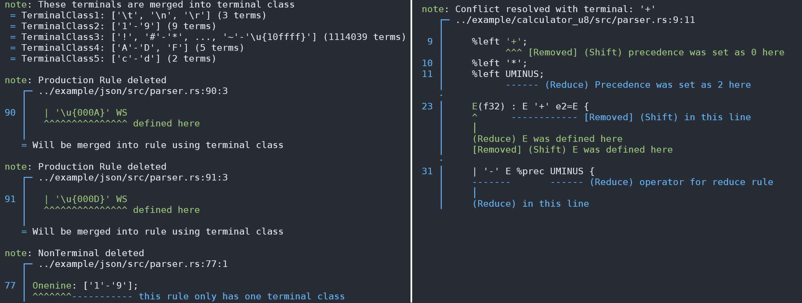

# rusty_lr
[](https://crates.io/crates/rusty_lr)
[](https://docs.rs/rusty_lr)

***A Bison-like parser generator for Rust supporting IELR(1), LALR(1) parser tables, with deterministic LR and
non-deterministic LR (GLR) parsing strategies.***

RustyLR is a parser generator that converts context-free grammars into IELR(1)/LALR(1) tables with deterministic LR and non-deterministic GLR parsing strategies. It supports custom reduce actions in Rust, with beautiful diagnostics.
Highly inspired by tools like *bison*, it uses a similar syntax while integrating seamlessly with Rust's ecosystem.
It constructs optimized state machines, ensuring efficient and reliable parsing.

#### Optimization in action: Terminal symbols reduced to 32 (from 0x10FFFF!)


## Features
 - **Custom Reduce Actions:** Define custom actions in Rust, allowing you to build custom data structures easily.
 - **Automatic Optimization:** Reduces parser table size and improves performance by grouping terminals with identical behavior across parser states.
 - **Multiple Parsing Strategies:** Supports minimal-LR(1), LALR(1) parser tables, and GLR parsing strategy.
 - **Detailed Diagnostics:** Detects grammar conflicts, verbose conflict resolution stages, and optimization stages.
 - **Location Tracking:** Tracks the location of every token in the parse tree, useful for error reporting and debugging.

 ## Installation & Usage
 Add RustyLR to your `Cargo.toml`:
 ```toml
 [dependencies]
 rusty_lr = "..."
 ```
 
 To work with `rusty_lr`, you need to generate parser code using one of the following methods:
  - **Procedural macros:** Use the built-in `lr1!` macro
  - **Build script:** Enable the `build` feature and generate parser code during the build process
    ```toml
    [build-dependencies]
    rusty_lr = { version = "...", features = ["build"] }
    ```
  - **Executable:** Use the standalone `rustylr` executable to generate parser code
    ```sh
    cargo install rustylr
    ```

**Recommendation:** Use the `rustylr` executable. It's faster and provides helpful grammar diagnostics.

**Important:** Ensure the version of the generated code targets the same version of `rusty_lr` in your `Cargo.toml`. Otherwise, you may encounter build errors.

 ### Using Procedural Macros
 Define your grammar using the `lr1!` macro:
 ```rust
// This defines an `EParser` struct where `E` is the start symbol
pub enum MyToken {
    Num(i32),
    Op(char),
    Whitespace(char),
    EOF,
}

lr1! {
    %userdata i32;              // User data type passed to parser
    %tokentype MyToken;         // Token type; sequence of tokens fed to parser
    %start E;                   // Start symbol; this is the final value of parser
    %eof MyToken::EOF;          // End-of-file token

    // Token definitions
    %token num  MyToken::Num(_);
    %token plus MyToken::Op('+');
    %token star MyToken::Op('*');
    %token ws   MyToken::Whitespace(_);

    // Left reduction for '+' and '*'
    // Operator precedence: '*' > '+'
    %left plus;
    %left star;

    // ================= Production Rules =================
    Number(i32)                  // Production rule `Number` holds `i32` value
        : ws* num ws*            // `Number` is one `num` surrounded by zero or more whitespaces
        { 
            // Extract the numeric value from the first token
            if let MyToken::Num(value) = num {
                value
            } else {
                0
            }
        };

    E(f32): E star e2=E { E * e2 }
          | E plus e2=E {
              *data += 1;                       // Access userdata via `data`
              println!("Values: {:?} {:?}", E, e2);   // Any Rust code can be written here
              E + e2                            // This becomes the value of `E` (f32)
          }
          | Number { Number as f32 }           // Number is `i32`, so cast to `f32`
          ;
}
```
This defines a simple arithmetic expression parser that can handle expressions like `2 + 3 * 4`.

### Using Build Script
For complex grammars, you can use a build script to generate the parser. This approach provides more detailed error messages when conflicts occur.

**1. Create a grammar file** (e.g., `src/parser.rs`) with the following content:
```rust
// Rust code: `use` statements and type definitions
use std::collections::HashMap;

pub enum MyToken {
    Identifier(String),
    Number(i32),
    // ... other token types
}

%% // Grammar definition starts here

%tokentype MyToken;
%start E;
%eof MyToken::EOF;

%token id MyToken::Identifier(_);
%token num MyToken::Number(_);

E: id
 | num
 ;
```

**2. Set up `build.rs`**:
```rust
// build.rs
use rusty_lr::build;

fn main() {
    println!("cargo::rerun-if-changed=src/parser.rs");

    let output = format!("{}/parser.rs", std::env::var("OUT_DIR").unwrap());
    build::Builder::new()
        .file("src/parser.rs")     // Path to the input grammar file
        .build(&output);           // Path to the generated output file
}
```

**3. Include the generated source code:**
```rust
include!(concat!(env!("OUT_DIR"), "/parser.rs"));
```

**4. Use the parser in your code:**
```rust
let parser = parser::EParser::new();        // Create <StartSymbol>Parser instance
let mut context = parser::EContext::new();  // Create <StartSymbol>Context instance
let mut userdata: i32 = 0;

for token in tokens {
    match context.feed(&parser, token, &mut userdata) {
        Ok(_) => {}
        Err(e) => {
            eprintln!("Parse error: {}", e);
            return;
        }
    }
}

// Feed EOF token to complete parsing
context.feed(&parser, MyToken::EOF, &mut userdata).unwrap();

// Get the final parsed result
let result: i32 = context.accept().unwrap();
```

### Using the `rustylr` Executable
[](https://crates.io/crates/rustylr)

```bash
cargo install rustylr
rustylr input_grammar.rs output_parser.rs
```

See the [Executable Documentation](rusty_lr_executable/README.md) for more details.

## Generated Code Structure

The generated code will include several structs and enums:
 - `<Start>Parser`: A struct that holds the parser table. [(LR docs)](https://docs.rs/rusty_lr/latest/rusty_lr/lr/trait.Parser.html) [(GLR docs)](https://docs.rs/rusty_lr/latest/rusty_lr/glr/trait.Parser.html)
 - `<Start>Context`: A struct that maintains the current parsing state and symbol values. [(LR docs)](https://docs.rs/rusty_lr/latest/rusty_lr/lr/struct.Context.html) [(GLR docs)](https://docs.rs/rusty_lr/latest/rusty_lr/glr/struct.Context.html)
 - `<Start>State`: A type representing a parser state and its associated table. 
 - `<Start>Rule`: A type representing a production rule. [(docs)](https://docs.rs/rusty_lr/latest/rusty_lr/struct.ProductionRule.html)
 - `<Start>NonTerminals`: An enum representing all non-terminal symbols in the grammar. [(docs)](https://docs.rs/rusty_lr/latest/rusty_lr/trait.NonTerminal.html)


### Working with Context
You can also get contextual information from the `<Start>Context` struct:
```rust
let mut context = <Start>Context::new();

// ... parsing ...

context.expected_token();    // Get expected terminal symbols
context.can_feed(&term);     // Check if a terminal symbol can be fed
context.trace();             // Get all `%trace` non-terminals currently being parsed
println!("{}", context.backtrace()); // Print backtrace of the parser state
println!("{}", context);     // Print tree structure of the parser state (`tree` feature)
```

### The Feed Method
The generated code includes a `feed` method that processes tokens:

```rust
context.feed(&parser, term, &mut userdata); // Feed a terminal symbol and update the state machine
context.feed_location(&parser, term, &mut userdata, term_location); // Feed a terminal symbol with location tracking
```

This method returns `Ok(())` if the token was successfully parsed, or an `Err` if there was an error.

**Note:** The actual method signatures differ slightly when building a GLR parser.

## GLR Parsing
RustyLR offers built-in support for Generalized LR (GLR) parsing, enabling it to handle ambiguous or nondeterministic grammars that traditional LR(1) or LALR(1) parsers cannot process.
See [GLR.md](GLR.md) for details.

## Error Handling and Conflict Resolution
RustyLR provides multiple mechanisms for handling semantic errors and resolving conflicts during parsing:
 - **Panic Mode Error Recovery:** Use the `error` token for panic-mode error recovery
 - **Operator Precedence:** Set precedence with `%left`, `%right`, `%precedence` for terminals
 - **Reduce Rule Priority:** Set priority with `%dprec` for production rules
 - **Runtime Errors:** Return `Err` from reduce actions to handle semantic errors

See [SYNTAX.md - Resolving Conflicts](SYNTAX.md#resolving-conflicts) for detailed information.

## Location Tracking
Track the location of tokens and non-terminals for better error reporting and debugging:

```rust
Expr: exp1=Expr '+' exp2=Expr {
    println!("Location of exp1: {:?}", @exp1);
    println!("Location of exp2: {:?}", @exp2);
    println!("Location of this expression: {:?}", @$); // @$ is the location of the non-terminal itself
    exp1 + exp2
}
| Expr error Expr {
    println!("Error at: {:?}", @error); // @error is the location of the error token
    0 // Return a default value
}
```

See [SYNTAX.md - Location Tracking](SYNTAX.md#location-tracking) for detailed information.

## Examples
 - [Calculator (enum version)](examples/calculator/src/parser.rs): A numeric expression parser using custom token enums
 - [Calculator (u8 version)](examples/calculator_u8/src/parser.rs): A numeric expression parser using byte tokens
 - [JSON Validator](examples/json/src/parser.rs): A JSON syntax validator
 - [Lua 5.4 syntax parser](https://github.com/ehwan/lua_rust/blob/main/parser/src/parser.rs): A complete Lua language parser
 - [Bootstrap parser](rusty_lr_parser/src/parser/parser.rs): RustyLR's own syntax parser is written in RustyLR itself

## Lexer Capabilities
While RustyLR is primarily a parser generator, it also functions effectively as a lexer.
Its design allows for efficient tokenization of input streams,
addressing challenges like the "too-many-characters" problem (where Unicode's full range of characters would make naive implementations impractical).
By constructing optimized state automata, it ensures rapid and memory-efficient lexing,
making it suitable for processing large or complex inputs.

## Cargo Features
 - `build`: Enables build script tools for generating parsers at compile time.
 - `tree`: Enables automatic syntax tree construction for debugging purposes. Makes `Context` implement `Display` for pretty-printing.

## Grammar Syntax
RustyLR's grammar syntax is inspired by traditional Yacc/Bison formats.
See [SYNTAX.md](SYNTAX.md) for detailed grammar definition syntax.

## Contributing
Contributions are welcome! Please feel free to open an issue or submit a pull request.

## License
This project is dual-licensed under either of the following licenses, at your option:

 - MIT License ([LICENSE-MIT](LICENSE-MIT) or http://opensource.org/licenses/MIT)
 - Apache License, Version 2.0 ([LICENSE-APACHE](LICENSE-APACHE) or http://www.apache.org/licenses/LICENSE-2.0)
