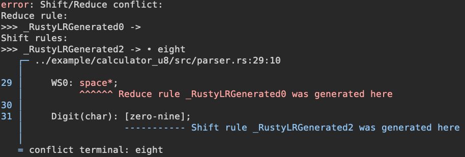

# RustyLR
yacc-like LR(1) and LALR(1) Deterministic Finite Automata (DFA) generator from Context Free Grammar (CFGs).

RustyLR provides both [executable](#executable-rustylr) and [procedural macros](#proc-macro-syntax) to generate LR(1) and LALR(1) parser.

```
[dependencies]
rusty_lr = "1.6.0"
```
`features=["fxhash"]` to replace `std::collections::HashMap` with [`FxHashMap`](https://github.com/rust-lang/rustc-hash)

### Simple definition of CFG
```rust
lr1! {
    // userdata type
    %userdata i32;
    // token type
    %tokentype char;
    // start symbol
    %start E;
    // eof symbol
    %eof '\0';

    // token definition
    %token zero '0';
    %token one '1';
    %token two '2';
    %token three '3';
    %token four '4';
    %token five '5';
    %token six '6';
    %token seven '7';
    %token eight '8';
    %token nine '9';
    %token plus '+';
    %token star '*';
    %token lparen '(';
    %token rparen ')';
    %token space ' ';

    // conflict resolving
    %left plus;
    %left star;

    // context-free grammars
    WS0: space*;

    Digit(char): [zero-nine];

    Number(i32): WS0 Digit+ WS0 { Digit.into_iter().collect::<String>().parse().unwrap() };

    A(f32): A plus a2=A {
        *data += 1; // access userdata by `data`
        println!( "{:?} {:?} {:?}", A, plus, a2 );
        A + a2 // this will be the new value of A
    }
        | M
        ;

    M(f32): M star m2=M { M * m2 }
        | P
        ;

    P(f32): Number { Number as f32 }
        | WS0 lparen E rparen WS0 { E }
        ;

    E(f32) : A ;
}
```

### Readable error messages (with [codespan](https://github.com/brendanzab/codespan))



## Contents
 - [syntax](#proc-macro-syntax)
 - [start parsing](#start-parsing)
 - [parse with callback](#parse-with-callback)
 - [using executable `rustylr`](#executable-rustylr)
 - [build DFA from CFG](#build-deterministic-finite-automata-dfa-from-context-free-grammar-cfg)

## Features
 - pure Rust implementation
 - readable error messages, both for grammar building and parsing
 - compile-time DFA construction from CFGs
 - customizable reduce action
 - resolving conflicts of ambiguous grammar
 - tracing parser action with callback
 - regex patterns partially supported
 - executable for generating parser tables from CFGs

## Usage

 - [Calculator](example/calculator): calculator with enum `Token`
 - [Calculator u8](example/calculator_u8): calculator with `u8`
 - [Bootstrap](rusty_lr_parser/src/parser/parser.rs), [Expanded Bootstrap](rusty_lr_parser/src/parser/parser_expanded.rs): bootstrapped line parser of `lr1!` and `lalr1!` macro, written in RustyLR itself.


## proc-macro syntax

Below procedural macros are provided:
 - `lr1!`, `lalr1!`

These macros will define three structs: `Parser`, `Context`, and `enum NonTerminals`, prefixed by `<StartSymbol>`.
In most cases, what you want is the `Parser` struct, which contains the DFA states and `feed()` functions.
Please refer to the [Start Parsing](#start-parsing) section below for actual usage of the `Parser` struct.

Those macros (those without '_runtime' suffix) will generate `Parser` struct at compile-time.
The calculation of building DFA will be done at compile-time, and the generated code will be *TONS* of `insert` of tokens one by one.

[Bootstrap](rusty_lr_parser/src/parser/parser.rs), [Expanded Bootstrap](rusty_lr_parser/src/parser/parser_expanded.rs) would be a good example to understand the syntax and generated code. It is RustyLR syntax parser written in RustyLR itself.

Every line in the macro must follow the syntax below.

### Token type <sub><sup>(must defined)</sup></sub>
```
'%tokentype' <RustType> ';'
```
Define the type of terminal symbols.
`<RustType>` must be accessible at the point where the macro is called.

<details>
<summary>
Example
</summary>

```rust
enum MyTokenType<Generic> {
    Digit,
    Ident,
    ...
    VariantWithGeneric<Generic>
}

lr! {
...
%tokentype MyTokenType<i32>;
}
```

</details>


### Token definition <sub><sup>(must defined)</sup></sub>
```
'%token' <Ident> <RustExpr> ';'
```
Map terminal symbol's name `<Ident>` to the actual value `<RustExpr>`.
`<RustExpr>` must be accessible at the point where the macro is called.

<details>

<summary>
Example
</summary>


```rust
lr1! {
%tokentype u8;

%token zero b'0';
%token one b'1';

...

// 'zero' and 'one' will be replaced by b'0' and b'1' respectively
E: zero one;
}
```

</details>

### Start symbol <sub><sup>(must defined)</sup></sub>
```
'%start' <Ident> ';'
```
Define the start symbol of the grammar.

<details>
<summary>
Example
</summary>

```rust
lr1! {
%start E;
// this internally generate augmented rule <Augmented> -> E eof

E: ... ;
}
```

</details>

### Eof symbol <sub><sup>(must defined)</sup></sub>
```
'%eof' <RustExpr> ';'
```
Define the `eof` terminal symbol.
`<RustExpr>` must be accessible at the point where the macro is called.
'eof' terminal symbol will be automatically added to the grammar.

<details>
<summary>
Example
</summary>

```rust
lr1! {
%eof b'\0';
// you can access eof terminal symbol by 'eof' in the grammar
// without %token eof ...;
}
```

</details>

### Userdata type <sub><sup>(optional)</sup></sub>
```
'%userdata' <RustType> ';'
```
Define the type of userdata passed to `feed()` function.

<details>
<summary>
Example
</summary>

```rust
struct MyUserData { ... }

lr1! {
...
%userdata MyUserData;
}

...

fn main() {
    ...
    let mut userdata = MyUserData { ... };
    parser.feed( ..., token, &mut userdata); // <-- userdata feed here
}
```

</details>


### Reduce type <sub><sup>(optional)</sup></sub>
```
// reduce first
'%left' <Ident> ';'
'%left' <TerminalSet> ';'

// shift first
'%right' <Ident> ';'
'%right' <TerminalSet> ';'
```
Set the shift/reduce precedence for terminal symbols. `<Ident>` must be defined in `%token`.
With `<TerminalSet>`, you can define reduce type to multiple terminals at once. Please refer to the [Regex Pattern](#regex-pattern) section below.
`%left` can be abbreviated as `%reduce` or `%l`, and `%right` can be abbreviated as `%shift` or `%r`.

<details>
<summary>
Example
</summary>

```rust
lr1! {
// define tokens
%token plus '+';
%token hat '^';


// reduce first for token 'plus'
%left plus;

// shift first for token 'hat'
%right hat;
}
```

```rust
lr1! {
// define tokens
%token zero b'0';
%token one b'1';
...
%token nine b'9';

// shift first for tokens in range 'zero' to 'nine'
%shift [zero-nine];
}
```

</details>

### Production rules
```
<Ident><RuleType>
  ':' <TokenMapped>* <ReduceAction>
  '|' <TokenMapped>* <ReduceAction>
  ...
  ';'
```
Define the production rules.

```
<TokenMapped> : <Ident as var_name> '=' <TokenPattern>
              | <TokenPattern>
              ;
```
```
<TokenPattern> : <Ident as terminal or non-terminal>
               | <TerminalSet>
               | <TokenPattern> '*'    (zero or more)
               | <TokenPattern> '+'    (one or more)
               | <TokenPattern> '?'    (zero or one)
               ;
```

<details>
<summary>
Example
</summary>

This production rule defines non-terminal `E` to be `A`, then zero or more `plus`, then `D` mapped to variable `d`.
For more information, please refer to the [Accessing token data in ReduceAction](#accessing-token-data-in-reduceaction) section below.
```rust
lr1! {
E: A plus* d=D;
}
```

</details>

### Regex pattern
Regex patterns are partially supported. You can use `*`, `+`, `?` to define the number of repetitions, and `[]` to define the set of terminal symbols.

```
%token lparen '(';
%token rparen ')';
%token zero '0';
...
%token nine '9';

A: [zero-nine]+; // zero to nine

B: [^lparen rparen]; // any token except lparen and rparen

C: [lparen rparen one-nine]*; // lparen and rparen, and one to nine
```

Note that when using range pattern `[first-last]`,
the range is constructed by the order of the `%token` directives,
not by the actual value of the token.
If you define tokens in the following order:
```
%token one '1';
%token two '2';
...
%token zero '0';
%token nine '9';
```
The range `[zero-nine]` will be `['0', '9']`, not `['0'-'9']`.


### RuleType <sub><sup>(optional)</sup></sub>
```
<RuleType> : '(' <RustType> ')'
           |
           ;
```
Define the type of value that this production rule holds.

<details>
<summary>
Example
</summary>

```rust
lr1! {
E(MyType<...>): ... Tokens ... ;
}
```

</details>

### ReduceAction <sub><sup>(optional)</sup></sub>
```
<ReduceAction> : '{' <RustExpr> '}'
               |
               ;
```

Define the action to be executed when the rule is matched and reduced.

- If `<RuleType>` is defined, `<ReduceAction>` itself must be the value of `<RuleType>` (i.e. no semicolon at the end of the statement).

- `<ReduceAction>` can be omitted if:
  - `<RuleType>` is not defined
  - Only one token is holding value in the production rule ( Non-terminal symbol with `<RuleType>` defined, or terminal symbols are considered as holding value )

- `Result<(),Error>` can be returned from `<ReduceAction>`.
  - Returned `Error` will be delivered to the caller of `feed()` function.
  - `ErrorType` can be defined by `%err` or `%error` directive. See [Error type](#error-type-optional) section.

<details>
<summary>
Example
</summary>

Omitting `ReduceAction`:
```rust
lr1! {
NoRuleType: ... ;

RuleTypeI32(i32): ... { 0 } ;

// RuleTypeI32 will be chosen
E(i32): NoRuleType NoRuleType RuleTypeI32 NoRuleType;
}
```

Returning `Result<(),String>` from ReduceAction:
```rust
lr1! {
// set Err variant type to String
%err String;

%token div '/';

E(i32): A div a2=A {
    if a2 == 0 {
        return Err("Division by zero".to_string());
    }

    A / a2
};

A(i32): ... ;
}
```

</details>

### Accessing token data in ReduceAction

**predefined variables** can be used in `<ReduceAction>`:
 - `data` : userdata passed to `feed()` function.

To access the data of each token, you can directly use the name of the token as a variable.
For non-terminal symbols, the type of variable is `<RuleType>`.
For terminal symbols, the type of variable is `%tokentype`.

If multiple variables are defined with the same name, the variable on the front-most will be used.

For regex pattern, type of variable will be modified by following:
 | Pattern | Non-Terminal<br/>`<RuleType>=T` | Non-Terminal<br/>`<RuleType>=(not defined)` | Terminal<br/>TerminalSet |
 |:-------:|:--------------:|:--------------------------:|:--------:|
 | '*'     | `Vec<T>`       | (not defined)              | `Vec<TermType>` |
 | '+'     | `Vec<T>`       | (not defined)              | `Vec<TermType>` |
 | '?'     | `Option<T>`    | (not defined)              | `Option<TermType>` |

<details>
<summary>
Example
</summary>

```rust
lr1! {
%token plus ...;

// one or more 'A', then optional 'plus', then zero or more 'B'
E(f32) : A+ plus? b=B* minus_or_star=[minus star]
  {
    println!("Value of A: {:?}", A);         // Vec<i32>
    println!("Value of plus: {:?}", plus); // Option<TermType>
    println!("Value of b: {:?}", b);       // Vec<f32>
    println!("Value of minus_or_star: {:?}", minus_or_star); // must explicitly define the variable name

    let first_A = A[0];
    let first_B = b.first(); // Option<&f32>


    // this will be the new value of E
    if let Some(first_B) = first_B {
        let value = first_A as f32 + *first_B;
        value
    } else {
        first_a as f32
    }
  }
  ;

A(i32): ... ;
B(f32): ... ;
}
```

</details>


### Error type <sub><sup>(optional)</sup></sub>
```
'%err' <RustType> ';'
'%error' <RustType> ';'
```
Define the type of `Err` variant in `Result<(), Err>` returned from `<ReduceAction>`. If not defined, `String` will be used.

<details>
<summary>
Example
</summary>

```rust
enum MyErrorType<T> {
    ErrVar1,
    ErrVar2,
    ErrVar3(T),
    ...
}

lr1! {

%err MyErrorType<GenericType> ;

}

...

match parser.feed( ... ) {
    Ok(_) => {}
    Err(err) => {
        match err {
            ParseError::ReduceAction( err ) => {
                // do something with err
            }
            _ => {}
        }
    }
}
```

</details>


## Start Parsing
`<StartSymbol>Parser` will be generated by the procedural macros.

The parser struct has the following functions:
 - `new()` : create new parser
 - `begin(&self)` : create new context
 - `feed(&self, &mut Context, TermType, &mut UserData) -> Result<(), ParseError>` : feed token to the parser
 - `feed_callback(&self, &mut Context, &mut C: Callback, TermType, &mut UserData) -> Result<(), ParseError>` : feed token with callback

Note that the parameter `&mut UserData` is omitted if `%userdata` is not defined.
Once the input sequence is feeded (including `eof` token), without errors, you can get the value of start symbol by calling `context.accept()`.

```rust
let parser = parser::EParser::new();
// create context
let mut context = parser.begin();
// define userdata
let mut userdata: i32 = 0;

// start feeding tokens
for token in input_sequence {
    match parser.feed(&mut context, token, &mut userdata) {
        //                          ^^^^^   ^^^^^^^^^^^^ userdata passed here as `&mut i32`
        //                           |- feed token
        Ok(_) => {}
        Err(e) => {
            println!("{}", e);
            // println!( "{}", e.long_message() ); // for more detailed error message
            return;
        }
    }
}
// res = value of start symbol
let res = context.accept();
println!("{}", res);
println!("userdata: {}", userdata);
```


## Parse with callback

For tracing parser action, you can implement `Callback` trait and pass it to `parser.feed_callback()`.

```rust
struct ParserCallback {}

impl rusty_lr::Callback<Term, NonTerm> for ParserCallback {
    /// Error type for callback
    type Error = String;

    fn reduce(
        &mut self,
        rules: &[rusty_lr::ProductionRule<Term, NonTerm>],
        states: &[rusty_lr::State<Term, NonTerm>],
        state_stack: &[usize],
        rule: usize,
    ) -> Result<(), Self::Error> {
        // `Rule` is Display if Term, NonTerm is Display
        println!("Reduce by {}", rules[rule]);
        Ok(())
    }
    fn shift_and_goto(
        &mut self,
        rules: &[rusty_lr::ProductionRule<Term, NonTerm>],
        states: &[rusty_lr::State<Term, NonTerm>],
        state_stack: &[usize],
        term: &Term,
    ) -> Result<(), Self::Error> {
        Ok(())
    }
    fn shift_and_goto_nonterm(
        &mut self,
        rules: &[rusty_lr::ProductionRule<Term, NonTerm>],
        states: &[rusty_lr::State<Term, NonTerm>],
        state_stack: &[usize],
        nonterm: &NonTerm,
    ) -> Result<(), Self::Error> {
        Ok(())
    }
}
```

Note that generic type `Term` and `NonTerm` must be replaced with actual types. `Term` must be same as `%tokentype`, and `NonTerm` must be `<StartSymbol>NonTerminals` generated by the procedural macro.

```rust
// Num + Num * ( Num + Num )
let terms = vec![ Term::Num, Term::Plus, Term::Num, Term::Mul, Term::LeftParen, Term::Num, Term::Plus, Term::Num, Term::RightParen, Term::Eof];

// start parsing
let mut context = parser.begin();
let mut callback = ParserCallback {};

// feed input sequence
for term in terms {
    match parser.feed_callback(&mut context, &mut callback, term) {
        Ok(_) => (),
        Err(err) => {
            match err {
                rusty_lr::ParseError::Callback(err) => {
                    eprintln!("{}", err);
                }
                _ => {}
            }
            return;
        }
    }
}
```

The result will be:
```
Reduce by P -> Num
Reduce by M -> P
Reduce by A -> M
Reduce by P -> Num
Reduce by M -> P
Reduce by P -> Num
Reduce by M -> P
Reduce by A -> M
Reduce by P -> Num
Reduce by M -> P
Reduce by A -> M
Reduce by A -> A + A
Reduce by E -> A
Reduce by P -> ( E )
Reduce by M -> P
Reduce by M -> M * M
Reduce by A -> M
Reduce by A -> A + A
Reduce by E -> A
```


## executable `rustylr`
An executable version of `lr1!` and `lalr1!` macro.
Converts a context-free grammar into a deterministic finite automaton (DFA) tables,
and generates a Rust code that can be used as a parser for that grammar.

```
cargo install rustylr
```

This executable will provide much more detailed, pretty-printed error messages than the procedural macros.
If you are writing a huge, complex grammar, it is recommended to use this executable than the procedural macros.
`--verbose` option is useful for debugging the grammar. It will print the auto-generated rules and the resolving process of shift/reduce conflicts. [like](images/example1.png) [this](images/example2.png)

Although it is convenient to use the proc-macros for small grammars,
since modern IDEs feature (rust-analyzer's auto completion, inline error messages) could be enabled.

This program searches for `%%` in the input file.

The contents before `%%` will be copied into the output file as it is.
Context-free grammar must be followed by `%%`.
Each line must follow the syntax of [rusty_lr#syntax](#proc-macro-syntax).

```rust
// my_grammar.rs
use some_crate::some_module::SomeStruct;

enum SomeTypeDef {
    A,
    B,
    C,
}

%% // <-- input file splitted here

%tokentype u8;
%start E;
%eof b'\0';

%token a b'a';
%token lparen b'(';
%token rparen b')';

E: lparen E rparen
 | P
 ;

P: a;
```

Calling the command will generate a Rust code `my_parser.rs`.
```
$ rustylr my_grammar.rs my_parser.rs
```


```
$ rustylr --help
Usage: rustylr [OPTIONS] <INPUT_FILE> [OUTPUT_FILE]

Arguments:
  <INPUT_FILE>
          input_file to read

  [OUTPUT_FILE]
          output_file to write

          [default: out.tab.rs]

Options:
      --no-format
          do not rustfmt the output

  -l, --lalr
          build LALR(1) parser

  -v, --verbose
          print debug information.
    
          print the auto-generated rules, and where they are originated from.
          print the shift/reduce conflicts, and the resolving process.
```


## Build Deterministic Finite Automata (DFA) from Context Free Grammar (CFG)
This section will describe about the core library, how to build DFA from CFGs, on runtime.
<details>
<summary>
Click to expand
</summary>

### 1. Define terminal and non-terminal symbols

```rust
#[derive(Clone, Hash, PartialEq, Eq, PartialOrd, Ord)] // must implement these traits
pub enum Term {
    Num,
    Plus,
    Mul,
    LeftParen,
    RightParen,
    Eof,
}

#[derive(Clone, Hash, PartialEq, Eq, PartialOrd, Ord)] // must implement these traits
pub enum NonTerm {
    E,
    A,
    M,
    P,
    Augmented,
}

/// impl Display for TermType, NonTermType will make related ProductionRule, error message Display-able
impl Display for TermType { ... }
impl Display for NonTermType { ... }
```
Or simply, you can use `char` or `u8` as terminal, and `&'static str` or `String` as non-terminal.
***Any type*** that implements traits above can be used as terminal and non-terminal symbols.

### 2. Define production rules
Consider the following context free grammar.
```
A -> A + A  (reduce left)
A -> M
```
This grammar can be written as:
```rust
/// type alias
type Token = rusty_lr::Token<Term, NonTerm>;

/// create grammar
let mut grammar = rusty_lr::Grammar::<Term,NonTerm>::new();

grammar.add_rule(
    NonTerm::A,
    vec![Token::NonTerm(NonTerm::A), Token::Term(Term::Plus), Token::NonTerm(NonTerm::A)],
);
grammar.add_rule(
    NonTerm::A,
    vec![Token::NonTerm(NonTerm::M)],
);

/// set reduce type
grammar.set_reduce_type( Term::Plus, ReduceType::Left );
```

Note that the production rule `A -> A + A` has a shift/reduce conflict. To resolve this conflict, the precedence of shift/reduce is given to terminal symbol `Plus`. `Left` means that for `Plus` token, the parser will reduce the rule instead of shifting the token.

reduce/reduce conflict (e.g. duplicated rules) will be always an error.

### 3. Build DFA
Calling `grammar.build()` for LR(1) or `grammar.build_lalr()` for LALR(1) will build the DFA from the CFGs.

```rust
let parser:rusty_lr::Parser<Term,NonTerm> = match grammar.build(NonTerm::Augmented) {
    Ok(parser) => parser,
    Err(err) => {
        // error is Display if Term, NonTerm is Display
        eprintln!("{}", err);
        return;
    }
};
```

You must explicitly specify the Augmented non-terminal symbol, and the Augmented production rule must be defined in the grammar.
```
Augmented -> StartSymbol $
```

The returned `Parser` struct contains the DFA states and the production rules(cloned).
It is completely independent from the `Grammar`, so you can drop the `Grammar` struct, or export the `Parser` struct to another module.

### 4. Error messages
The `Error` type returned from `Grammar::build()` will contain the error information.
You can manually `match` the error type for custom error message,
but for most cases, using `println!("{}", err)` will be enough to see the detailed errors.
Error is `Display` if both `Term` and `NonTerm` is `Display`, and It is `Debug` if both `Term` and `NonTerm` is `Debug`.

#### Sample error messages
For Shift/Reduce conflicts,
```
Build failed: Shift/Reduce Conflict
NextTerm: '0'
Reduce Rule:
"Num" -> "Digit"
Shift Rules:
"Digit" -> '0' • /Lookaheads: '\0', '0'
Try rearanging the rules or set ReduceType to Terminal '0' to resolve the conflict.
```
For Reduce/Reduce conflicts,
```
Build failed: Reduce/Reduce Conflict with lookahead: '\0'
Production Rule1:
"Num" -> "Digit"
Production Rule2:
"Num" -> "Digit"
```

## Parse input sequence with generated DFA
For given input sequence, you can start parsing with `Parser::begin()` method.
Once you get the `Context` from `begin()`,
you can feed the input sequence one by one with `Parser::feed()` method.

```rust
let terms = vec![ Term::Num, Term::Plus, Term::Num, Term::Mul, Term::LeftParen, Term::Num, Term::Plus, Term::Num, Term::RightParen, Term::Eof];

// start parsing
let mut context = parser.begin();

// feed input sequence
for term in terms {
    match parser.feed(&mut context, term) {
        Ok(_) => (),
        Err(err) => {
            eprintln!("{:?}", err);
            return;
        }
    }
}
```

`EOF` token is feeded at the end of sequence, and the augmented rule `Augmented -> StartSymbol $` will not be reduced since there are no lookahead symbols.

</details>
