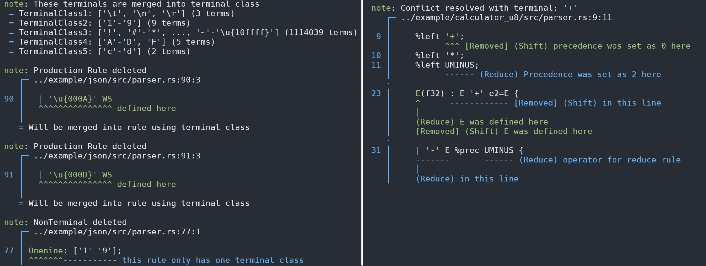
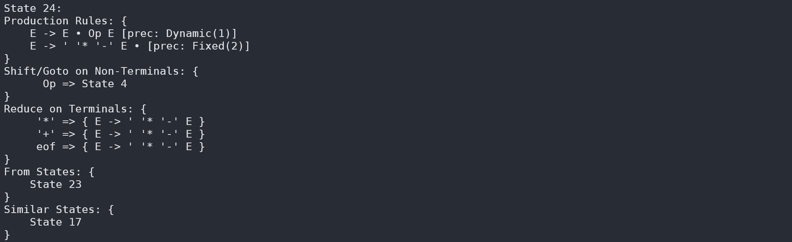
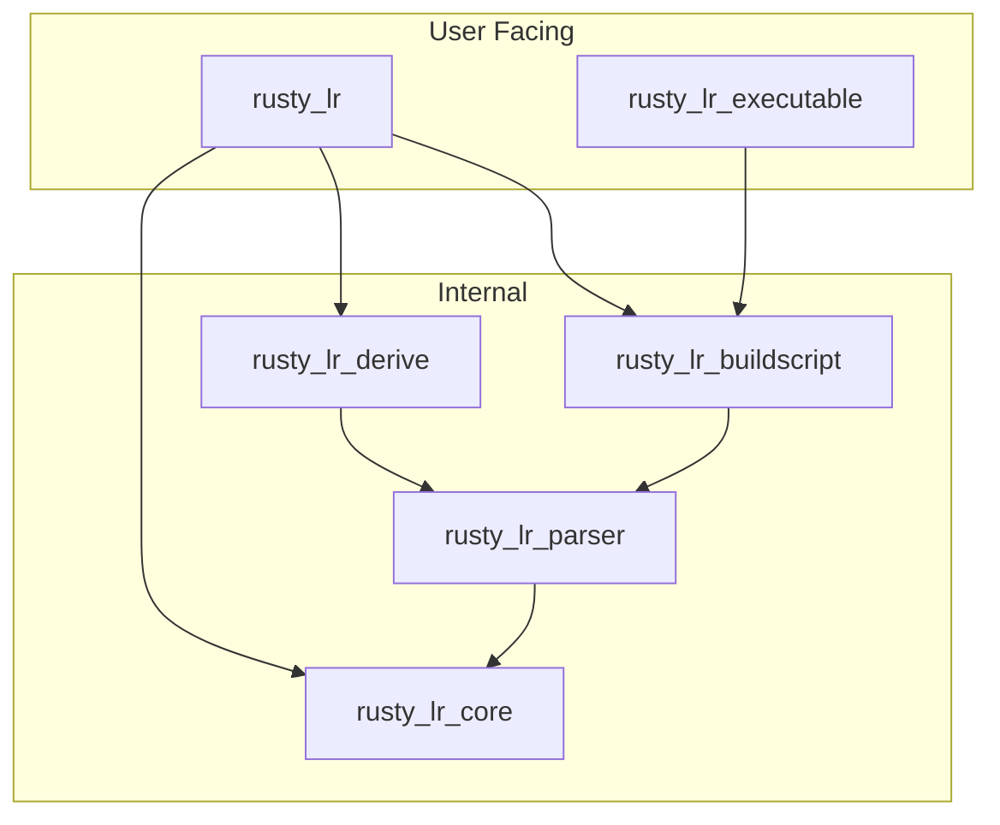

# rusty_lr

[](https://crates.io/crates/rusty_lr)
[](https://docs.rs/rusty_lr)

***A Bison-like parser generator and compiler frontend for Rust. It generates optimized IELR(1) and LALR(1) parsing tables, supporting both deterministic LR and non-deterministic Generalized LR (GLR) parsing.***

RustyLR is a robust parser generator that converts context-free grammars into optimized IELR(1) or LALR(1) tables. It seamlessly integrates with the Rust ecosystem, allowing you to write custom reduce actions directly in Rust with rich, diagnostic-driven error reporting. 

Highly inspired by classic tools like *Bison* and *Yacc*, RustyLR uses a familiar syntax while offering modern features such as state optimization, location tracking, generalized parsing, and compile-time/runtime conflict resolution.



## Features

- **Custom Reduce Actions:** Define actions directly in Rust to build abstract syntax trees (ASTs) or custom data structures easily.
- **Automatic Parser Optimization:** Shrinks parsing tables and boosts runtime performance by grouping terminal symbols that exhibit identical behavior across parser states.
- **Multiple Parsing Strategies:** Supports minimal-LR(1) (IELR-style), LALR(1) tables, and Generalized LR (GLR) parsing.
- **Detailed Diagnostics:** Reports grammar conflicts, provides verbose traces of conflict resolution stages, and logs optimization passes.
- **Static & Runtime Conflict Resolution:** Resolve grammar conflicts at compile time (precedence/associativity) or dynamically at runtime.
- **Location Tracking:** Automatically tracks positions of tokens and non-terminals, simplifying error reporting in compiler diagnostics.
- **State Machine Debugging:** The `rustylr` CLI provides a `--state` flag to inspect and visualize the generated state machine, making conflict debugging straightforward.

---

## Quick Start: Using the `rustylr` CLI

The recommended way to use RustyLR is via the standalone `rustylr` CLI executable. It offers faster compilation, comprehensive grammar diagnostics, and interactive tools for debugging state machines.

### 1. Add `rusty_lr` to your dependencies
Add the runtime library to your `Cargo.toml`. The generated parser will depend on it.

```toml
[dependencies]
rusty_lr = "..." # Ensure this matches the version of the CLI executable
```

### 2. Install the `rustylr` CLI
Install the command-line generator from crates.io using Cargo:

```bash
cargo install rustylr
```

### 3. Create a Grammar File
Create a grammar file, e.g., `src/grammar.rs`. Any Rust code placed *above* the `%%` delimiter is copied directly to the generated parser file. The section *below* `%%` defines directives and grammar rules.

```rust
// src/grammar.rs

#[derive(Debug, Clone, Copy)]
pub enum Token {
    Num(i32),
    Plus,
    Minus,
    Mul,
    Div,
    LParen,
    RParen,
}

%%

// Define the token type and the start symbol
%tokentype Token;
%start Expr;

// Declare operator precedence and associativity (lowest to highest)
%left plus minus;
%left mul div;

// Map grammar terminals to Token enum variants
%token num Token::Num(_);
%token plus Token::Plus;
%token minus Token::Minus;
%token mul Token::Mul;
%token div Token::Div;
%token lparen Token::LParen;
%token rparen Token::RParen;

// Production rules
// Expr(i32) means the non-terminal Expr returns an i32.
// In the action block `{ ... }`, reference RHS symbols by their names.
Expr(i32)
    : e1=Expr plus e2=Expr   { e1 + e2 }
    | e1=Expr minus e2=Expr  { e1 - e2 }
    | e1=Expr mul e2=Expr    { e1 * e2 }
    | e1=Expr div e2=Expr    { e1 / e2 }
    | lparen e=Expr rparen   { e }
    | num {
        if let Token::Num(val) = num {
            val
        } else {
            unreachable!()
        }
    }
    ;
```

### 4. Generate the Parser Code
Run the CLI to compile your grammar into a Rust module:

```bash
rustylr src/grammar.rs src/parser.rs
```

### 5. Parse a Token Stream
Include the generated `src/parser.rs` file in your project and feed it a stream of tokens:

```rust
// src/main.rs
mod parser;
use parser::Token;

fn main() {
    // Represents the expression: 3 + 4 * 2
    let tokens = vec![
        Token::Num(3),
        Token::Plus,
        Token::Num(4),
        Token::Mul,
        Token::Num(2),
    ];

    let parser = parser::ExprParser::new();
    let mut context = parser::ExprContext::new();
    let mut userdata = (); // No custom user data needed

    for token in tokens {
        if let Err(err) = context.feed(&parser, token, &mut userdata) {
            eprintln!("Parse error: {}", err);
            return;
        }
    }

    match context.accept(&parser, &mut userdata) {
        Ok(result) => {
            println!("Parsed result: {}", result); // Output: 11
        }
        Err(err) => {
            eprintln!("Failed to finalize parsing: {}", err);
        }
    }
}
```

> [!IMPORTANT]
> The version of the `rustylr` CLI executable must exactly match the version of the `rusty_lr` library in your `Cargo.toml`. Version mismatches may result in build failures.

---

## Generated Code Structure

The generated parser module contains several generated components tailored to your start symbol:
- **`<Start>Parser`**: A lightweight struct containing the static parsing tables. [(docs)](https://docs.rs/rusty_lr/latest/rusty_lr/parser/trait.Parser.html)
- **`<Start>Context`**: A mutable state context that keeps track of the stack and parsed symbol values. [(LR docs)](https://docs.rs/rusty_lr/latest/rusty_lr/parser/deterministic/struct.Context.html) [(GLR docs)](https://docs.rs/rusty_lr/latest/rusty_lr/parser/nondeterministic/struct.Context.html)
- **`<Start>State`**: An internal type representing individual states in the parser. [(docs)](https://docs.rs/rusty_lr/latest/rusty_lr/parser/state/trait.State.html)
- **`<Start>Rule`**: An internal enum representing production rules. [(docs)](https://docs.rs/rusty_lr/latest/rusty_lr/rule/struct.ProductionRule.html)
- **`<Start>NonTerminals`**: An enum representing all non-terminal symbols. [(docs)](https://docs.rs/rusty_lr/latest/rusty_lr/parser/nonterminal/trait.NonTerminal.html)

### Interacting with the Parsing Context
The `<Start>Context` offers helpful utilities for inspecting and tracing:
```rust
let mut context = ExprContext::new();

// ... feed tokens ...

context.expected_token(&parser);    // Returns the expected symbols for the current state
context.can_feed(&parser, &token);  // Checks if a terminal can be fed next
context.trace(&parser);             // Retrieves active `%trace` non-terminals
println!("{}", context.backtrace(&parser)); // Prints the stack trace of parser states
println!("{}", context);     // Formats the state tree (requires 'tree' feature)
```

### Feeding Tokens
You can feed terminal symbols either with or without location information:
```rust
// Basic feeding
context.feed(&parser, token, &mut userdata);

// Location-aware feeding (requires %location in grammar)
context.feed_location(&parser, token, &mut userdata, token_location);
```

---

## GLR Parsing

RustyLR provides native support for Generalized LR (GLR) parsing. When you add the `%glr;` directive to a grammar, RustyLR generates a non-deterministic parser that forks state branches upon encountering shift/reduce or reduce/reduce conflicts. This is particularly useful for ambiguous grammars or complex programming languages.

For more details, see [GLR.md](GLR.md).

---

## Error Handling and Conflict Resolution

RustyLR provides multiple tools to resolve grammar ambiguities and handle parsing failures:
- **Panic-Mode Error Recovery:** Use the special `error` terminal to catch and recover from syntax errors. Unlike Bison's blocking loop-based recovery, RustyLR incrementally discards and merges subsequent unexpected tokens into the `error` token's location span on each `feed()`, enabling reactive stream parsing and accurate diagnostic spans.
- **Operator Precedence:** Disambiguate expressions with `%left`, `%right`, and `%precedence` directives.
- **Reduce Rule Priority:** Explicitly set reduce priorities with `%dprec`.
- **Runtime Error Propagation:** Return custom `Err` payloads from reduce actions to signal semantic or parsing errors.

See [SYNTAX.md - Resolving Conflicts](SYNTAX.md#resolving-conflicts) for in-depth information.

---

## Location Tracking

Track input spans automatically across tokens and non-terminals to print helpful compiler errors:

```rust
Expr(i32)
    : e1=Expr '+' e2=Expr {
        println!("Span of e1: {:?}", @e1);
        println!("Span of e2: {:?}", @e2);
        println!("Span of this Expr: {:?}", @$); // @$ (or @0) represents the current non-terminal's span
        e1 + e2
    }
    | Expr error Expr {
        println!("Syntax error recovery span: {:?}", @error);
        0 // Fallback value
    }
    ;
```

See [SYNTAX.md - Location Tracking](SYNTAX.md#location-tracking) for configuration details.

---

## State Machine Debugging

You can inspect the generated parser states using the `--state` option. This outputs a color-coded state listing showing core items, lookahead sets, transitions, and conflict reports.

```bash
rustylr --state src/grammar.rs
```



---

## Examples

- [Calculator (enum tokens)](https://github.com/ehwan/RustyLR/blob/main/example/calculator/src/parser.rs): A numeric expression parser using custom token enums.
- [Calculator (u8 tokens)](https://github.com/ehwan/RustyLR/blob/main/example/calculator_u8/src/parser.rs): A byte-stream numeric calculator.
- [JSON Validator](https://github.com/ehwan/RustyLR/blob/main/example/json/src/parser.rs): A validator checking JSON syntax.
- [Lua 5.4 Parser](https://github.com/ehwan/lua_rust/blob/main/parser/src/parser.rs): A complete parser for the Lua 5.4 programming language.
- [C Parser](https://github.com/ehwan/C-language-Parser-In-Rust/blob/main/src/ast/parser_lr.rs): An LR-based parser for the C programming language.
- [Bootstrap Parser](https://github.com/ehwan/RustyLR/blob/main/rusty_lr_parser/src/parser/parser.rs): RustyLR's own grammar parser, written using RustyLR.

---

## Cargo Features

- **`build`**: Enables helper functions in `rusty_lr_buildscript` for compiling grammars inside `build.rs` scripts.
- **`tree`**: Enables automatic syntax tree rendering for debugging. Implementing `Display` for `Context` outputs a formatted parse tree.

---

## Grammar Syntax

RustyLR's syntax builds upon standard Yacc/Bison design but is optimized for Rust.

See [SYNTAX.md](SYNTAX.md) for the complete reference.

### Type Inference with `_`
You can omit explicit rule types using the `_` placeholder. RustyLR will infer the type based on identity rules and reduce actions:

```rust
Expr(_): Term;
```

If a circular dependency prevents inference, RustyLR will report a compilation error.

---

## Contributing

We welcome issues and pull requests!

### Project Structure

This repository is organized as a Cargo workspace:

- **`rusty_lr/`**: The main user-facing library. Add this to your `Cargo.toml`.
- **`rusty_lr_core/`**: The runtime engine, defining stack logic, deterministic parsing (`src/parser/deterministic`), and GLR parsing (`src/parser/nondeterministic`).
- **`rusty_lr_parser/`**: The grammar compilation engine. Parses RustyLR files, constructs parsing tables, and generates Rust output.
- **`rusty_lr_derive/`**: Procedural macro wrapper around `rusty_lr_parser`, providing the `lr1!` macro.
- **`rusty_lr_buildscript/`**: Helper API for running RustyLR in cargo build scripts.
- **`rusty_lr_executable/`**: The standalone `rustylr` CLI executable.
- **`scripts/`**: Automation, regression test suites, and helper scripts.


```mermaid
graph TD;
    subgraph User Facing
        rusty_lr;
        rusty_lr_executable;
    end

    subgraph Internal
        rusty_lr_derive;
        rusty_lr_buildscript;
        rusty_lr_parser;
        rusty_lr_core;
    end

    rusty_lr --> rusty_lr_core;
    rusty_lr --> rusty_lr_derive;
    rusty_lr --> rusty_lr_buildscript;

    rusty_lr_derive --> rusty_lr_parser;
    rusty_lr_buildscript --> rusty_lr_parser;
    
    rusty_lr_executable --> rusty_lr_buildscript;

    rusty_lr_parser --> rusty_lr_core;
```

### Versioning Policy
RustyLR separates its components into two parts:
1. The compiler CLI (`rustylr`)
2. The runtime library (`rusty_lr`)

To maintain Cargo compatibility, patch versions are incremented when changes are backwards-compatible (meaning previously generated parser files compile without errors with the new library version). If a change to the code generator requires updates to the runtime library API that break older generated code, a minor version bump is performed.

---

## License

Dual-licensed under either:
- Apache License, Version 2.0 ([LICENSE-APACHE](LICENSE-APACHE) or http://www.apache.org/licenses/LICENSE-2.0)
- MIT license ([LICENSE-MIT](LICENSE-MIT) or http://opensource.org/licenses/MIT)
