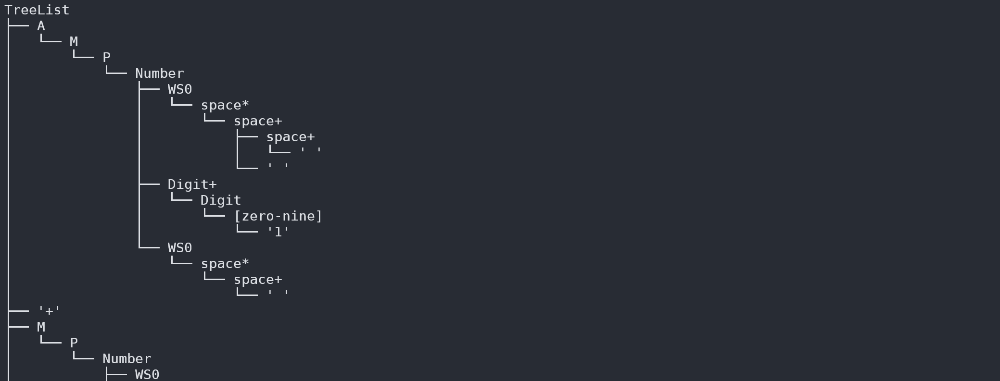

# rusty_lr
[](https://crates.io/crates/rusty_lr)
[](https://docs.rs/rusty_lr)

GLR, LR(1) and LALR(1) parser generator for Rust.

Please refer to [docs.rs](https://docs.rs/rusty_lr) for detailed example and documentation.

## Cargo Features
 - `build` : Enable buildscript tools.
 - `fxhash` : In parser table, replace `std::collections::HashMap` with `FxHashMap` from [`rustc-hash`](https://github.com/rust-lang/rustc-hash).
 - `tree` : Enable automatic syntax tree construction.
    This feature should be used on debug purpose only, since it will consume much more memory and time.
 - `error` : Enable detailed parsing error messages, for `Display` and `Debug` trait.
    This feature should be used on debug purpose only, since it will consume much more memory and time.

## Features
 - GLR, LR(1) and LALR(1) parser generator
 - Provides procedural macros and buildscript tools
 - readable error messages, both for parsing and building grammar
 - pretty-printed syntax tree
 - compile-time DFA construction
 - customizable reduce action
 - resolving conflicts of ambiguous grammar
 - regex patterns partially supported

Note that `src/grammar.rs` must follow the syntax described in [SYNTAX.md](SYNTAX.md).

## Example
```rust
// this define `EParser` struct
// where `E` is the start symbol
lr1! {
    %userdata i32;           // userdata type
    %tokentype char;         // token type
    %start E;                // start symbol
    %eof '\0';               // eof token

    // token definition
    %token zero '0';
    %token one '1';
    %token two '2';
    %token three '3';
    %token four '4';
    %token five '5';
    %token six '6';
    %token seven '7';
    %token eight '8';
    %token nine '9';
    %token plus '+';
    %token star '*';
    %token lparen '(';
    %token rparen ')';
    %token space ' ';

    // conflict resolving
    %left [plus star];                  // reduce first for token 'plus', 'star'

    // context-free grammars
    Digit(char): [zero-nine];           // character set '0' to '9'

    Number(i32)                         // type assigned to production rule `Number`
        : space* Digit+ space*          // regex pattern
    { Digit.into_iter().collect::<String>().parse().unwrap() };
    //    ^^^^^^^^^^^^^^^^^^^^^^^^^^^^^^^^^^^^^^^^^^^^^^ this will be the value of `Number`
                                        // reduce action written in Rust code

    A(f32): A plus a2=A {
        *data += 1;                     // access userdata by `data`
        println!( "{:?} {:?} {:?}", A, plus, a2 );
        A + a2
    }
        | M
        ;

    M(f32): M star m2=M { M * m2 }
        | P
        ;

    P(f32): Number { Number as f32 }
        | space* lparen E rparen space* { E }
        ;

    E(f32) : A ;
}
```
```rust
let parser = EParser::new();         // generate `EParser`
let mut context = EContext::new();   // create context
let mut userdata: i32 = 0;           // define userdata

let input_sequence = "1 + 2 * ( 3 + 4 )";

// start feeding tokens
for token in input_sequence.chars() {
    match context.feed(&parser, token, &mut userdata) {
        //                      ^^^^^   ^^^^^^^^^^^^ userdata passed here as `&mut i32`
        //                     feed token
        Ok(_) => {}
        Err(e) => {
            match e {
                EParseError::InvalidTerminal(invalid_terminal) => {
                    ...
                }
                EParseError::ReduceAction(error_from_reduce_action) => {
                    ...
                }
            }
            println!("{}", e);
            // println!( "{}", e.long_message( &parser, &context ) );
            return;
        }
    }
}
context.feed(&parser, '\0', &mut userdata).unwrap();    // feed `eof` token

let res = context.accept();   // get the value of start symbol
println!("{}", res);
println!("userdata: {}", userdata);
```

## Readable error messages (with [codespan](https://github.com/brendanzab/codespan))


 - This error message is generated by the buildscript tool, not the procedural macros.

## Visualized syntax tree

 - With `tree` feature enabled.

## detailed `ParseError` message

 - With `error` feature enabled.

## Syntax
See [SYNTAX.md](SYNTAX.md) for details of grammar-definition syntax.

 - [Bootstrap](rusty_lr_parser/src/parser/parser.rs): rusty_lr syntax is written in rusty_lr itself.


## Contribution
 - Any contribution is welcome.
 - Please feel free to open an issue or pull request.

## License (Since 2.8.0)
Either of
 - MIT license ([LICENSE-MIT](LICENSE-MIT) or http://opensource.org/licenses/MIT)
 - Apache License, Version 2.0 ([LICENSE-APACHE](LICENSE-APACHE) or http://www.apache.org/licenses/LICENSE-2.0)


## Other Examples
 - [Simple Calculator](examples/calculator_u8/src/parser.rs)
 - [lua 5.4 syntax parser](https://github.com/ehwan/lua_rust)
