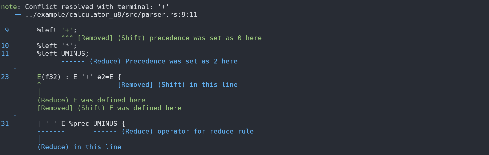

# rusty_lr
[](https://crates.io/crates/rusty_lr)
[](https://docs.rs/rusty_lr)

***A Yacc-like, procedural macro-based parser generator for Rust supporting LR(1), LALR(1), and GLR parsing strategies.***

RustyLR enables you to define context-free grammars (CFGs) directly in Rust using macros or build scripts. It constructs finite state automata at compile time, ensuring efficient and reliable parsing.​

## Features
 - **Multiple Parsing Strategies:** Supports LR(1), LALR(1), and GLR parsers.
 - **Procedural Macros:** Define grammars using lr1! macro for compile-time parser generation.
 - **Build Script Integration:** Generate parsers via build scripts for complex grammars with detailed error messages.​
 - **Custom Reduce Actions:** Define custom actions during reductions to build ASTs or perform computations.​
 - **Grammar Conflict Detection:** Automatically detects shift/reduce and reduce/reduce conflicts during parser generation, providing informative diagnostics to help resolve ambiguities.

 ## Installation
 Add RustyLR to your `Cargo.toml`:
 ```toml
 [dependencies]
 rusty_lr = "..."
 ```
 To use buildscript tools:
 ```toml
 [build-dependencies]
 rusty_lr = { version = "...", features = ["build"] }
 ```
 Or you want to use executable version (optional):
 ```sh
 cargo install rustylr
 ```

 `rusty_lr` is designed for use with auto-generated code,
 either through `lr1!` macro (default), a build script (with `build` feature), or the `rustylr` executable.
 When using a buildscript or executable, you can get beautiful and detailed messages generated from your grammar.

 ## Quick Start
 ### Using Procedural Macros
 Define your grammar using the `lr1!` macro:
 ```rust
// this define `EParser` struct
// where `E` is the start symbol
lr1! {
    %userdata i32;           // userdata type passed to parser
    %tokentype char;         // token type; sequence of `tokentype` is fed to parser
    %start E;                // start symbol; this is the final value of parser
    %eof '\0';               // eof token; this token is used to finish parsing

    %left '+';
    %left '*';

    // ================= Production rules =================
    Digit(char): ['0'-'9'];           // character set '0' to '9'

    Number(i32)                       // production rule `Number` holds `i32` value
        : ' '* Digit+ ' '*            // `Number` is one or more `Digit` surrounded by zero or more spaces
        { Digit.into_iter().collect::<String>().parse().unwrap() }; // this will be the value of `Number` (i32) by this production rule

    A(f32)
        : A '+' a2=A {
            *data += 1;                                 // access userdata by `data`
            println!( "{:?} {:?}", A, a2 );  // any Rust code can be written here
            A + a2                                      // this will be the value of `A` (f32) by this production rule
        }
        | M
        ;

    M(f32): M '*' m2=M { M * m2 }
        | Number { Number as f32 } // Number is `i32`, so cast to `f32`
        ;

    E(f32) : A ; // start symbol
}
```
This defines a simple arithmetic expression parser.
### Using Build Script
For complex grammars, you can use a build script to generate the parser. This will provide more detailed error messages when conflicts occur.

**1. Create a grammar file** (e.g., `src/parser.rs`) with the following content:
```rust

// Rust code of `use` and type definitions


%% // start of grammar definition

%tokentype u8;
%start E;
%eof b'\0';

E: b'(' E b')' 
 | a;

 ...

```

**2. Setup `build.rs`**:
```rust
// build.rs
use rusty_lr::build;

fn main() {
    println!("cargo::rerun-if-changed=src/parser.rs");

    let output = format!("{}/parser.rs", std::env::var("OUT_DIR").unwrap());
    build::Builder::new()
        .file("src/parser.rs") // path to the input file
        .build(&output);       // path to the output file
}
```

**3. Include the generated source code:**
```rust
include!(concat!(env!("OUT_DIR"), "/parser.rs"));
```

**4. Use the parser in your code:**
```rust
let mut parser = parser::EParser::new(); // create <StartSymbol>Parser class
let mut context = parser::EContext::new(); // create <StartSymbol>Context class
let mut userdata: i32 = 0;
for b in input.chars() {
    match context.feed(&parser, b, &mut userdata) {
        Ok(_) => {}
        Err(e) => {
            eprintln!("error: {}", e);
            return;
        }
    }
}
println!("{:?}", context);
context.feed(&parser, 0 as char, &mut userdata).unwrap(); // feed EOF

let result:i32 = context.accept(); // get value of start 'E'
```

The generated code will include several structs and enums:
 - `<Start>Parser`: A struct that holds the parser table.
 - `<Start>Context`: A struct that maintains the current state and the values associated with each symbol.
 - `<Start>State`: A type representing a single parser state and its associated table.
 - `<Start>Rule`: A type representing a single production rule.
 - `<Start>NonTerminals`: A enum representing all non-terminal symbols in the grammar (and its data).

Note that the actual definitions are bit different if you are building GLR parser.

## GLR Parsing
RustyLR offers built-in support for Generalized LR (GLR) parsing, enabling it to handle ambiguous or nondeterministic grammars that traditional LR(1) or LALR(1) parsers cannot process.
See [GLR.md](GLR.md) for details.

## Examples
 - [Calculator](examples/calculator_u8/src/parser.rs): A calculator using `u8` as token type.
 - [lua 5.4 syntax parser](https://github.com/ehwan/lua_rust/blob/main/parser/src/parser.rs)
 - [Bootstrap](rusty_lr_parser/src/parser/parser.rs): rusty_lr syntax parser is written in rusty_lr itself.

## Cargo Features
 - `build`: Enable build script tools.
 - `fxhash`: Use FXHashMap instead of `std::collections::HashMap` for parser tables.
 - `tree`: Enable automatic syntax tree construction (For debugging purposes).
 - `error`: Enable detailed parsing error messages (For debugging purposes).

## Syntax
RustyLR's grammar syntax is inspired by traditional Yacc/Bison formats.
See [SYNTAX.md](SYNTAX.md) for details of grammar-definition syntax.

## Contribution
 - Any contribution is welcome.
 - Please feel free to open an issue or pull request.

## License (Since 2.8.0)
Either of
 - MIT license ([LICENSE-MIT](LICENSE-MIT) or http://opensource.org/licenses/MIT)
 - Apache License, Version 2.0 ([LICENSE-APACHE](LICENSE-APACHE) or http://www.apache.org/licenses/LICENSE-2.0)

### Images
It is highly recommended to use buildscipt tools or executable instead of procedural macros, to generate readable error messages.
#### -Reduce/Reduce conflicts

#### - Shift/Reduce conflicts
